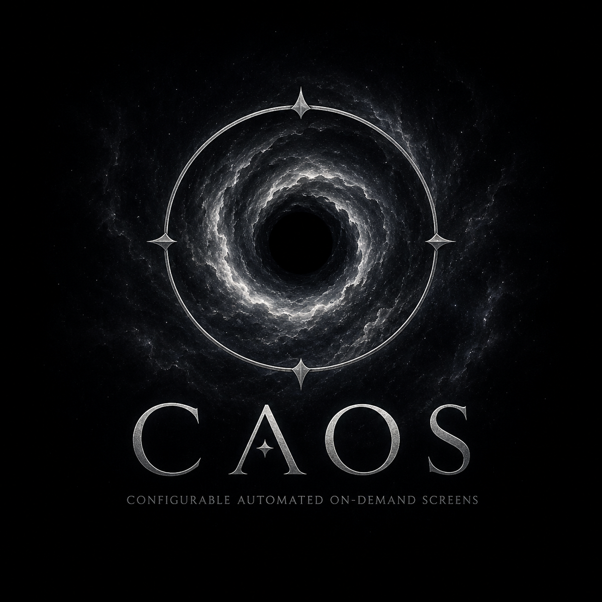
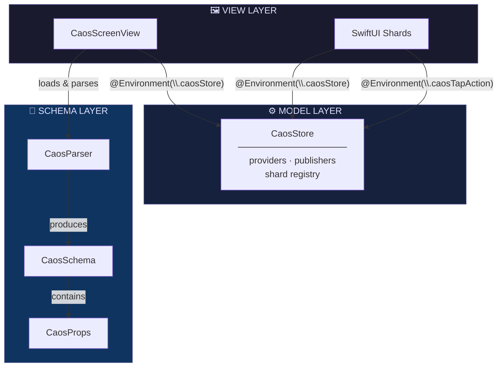

# Caos

[](https://github.com/andersontizaias/Caos/actions/workflows/ci.yml)
[](https://swift.org/package-manager/)
[](https://developer.apple.com/ios/)
[](https://swift.org)
[](LICENSE)

<p align="center">
  
</p>

**Caos** (**C**onfigurable **A**utomated **O**n-demand **S**creens) is an iOS Server-Driven UI framework that generates SwiftUI screens dynamically from YAML files. Change your UI without redeploying your app.

---

## Architecture



Caos follows the **MV (Model-View)** pattern — no ViewModels. `CaosStore` is the Model; views read from it via `@Environment`.

---

## Requirements

### Runtime

| Requirement | Minimum | Notes |
|---|---|---|
| iOS | 16.0 | SwiftUI, `.task`, `@Environment` |
| Swift | 5.9 | StrictConcurrency enabled |
| Xcode | 16.0 | Required to build and archive |

### Framework dependencies

| Dependency | Type | Purpose |
|---|---|---|
| SwiftUI | System (iOS 16+) | Rendering engine |
| Combine | System (iOS 13+) | Reactive data binding via `CaosStore` |
| Foundation | System | Bundle loading, string parsing |
| **No third-party dependencies** | — | Parser is stdlib-only; zero external packages |

### Local development tools

| Tool | Version | Install |
|---|---|---|
| Xcode | 16.0+ | [App Store](https://developer.apple.com/xcode/) |
| Homebrew | any | [brew.sh](https://brew.sh) |
| XcodeGen | 2.42.0+ | `brew install xcodegen` |
| SwiftLint | 0.57.0+ | `brew install swiftlint` |
| SwiftFormat | 0.61.1 | see [lint.yml](.github/workflows/lint.yml) |

> The `.xcodeproj` files are **generated by XcodeGen** and not versioned. The source of truth for the Xcode project is `project.yml`.

---

## Local Development

### 1. Clone

```bash
git clone https://github.com/andersontizaias/Caos.git
cd Caos
```

### 2. Generate the Xcode project and open

```bash
make setup   # installs XcodeGen via Homebrew (if needed) + generates both projects
make open    # generates + opens Caos.xcodeproj directly in Xcode
```

Or step by step, without Make:

```bash
brew install xcodegen          # one-time install
xcodegen generate              # generates Caos.xcodeproj at the root
open Caos.xcodeproj
```

### 3. Run tests

**In Xcode:** select the `Caos` scheme → `Cmd+U`.

**Via terminal** (no simulator required — runs on macOS):

```bash
swift test --enable-code-coverage
```

### 4. Run the Example app

```bash
xcodegen generate --spec Example/project.yml   # generates Example/CaosExample.xcodeproj
open Example/CaosExample.xcodeproj
```

Select an iOS simulator and press `Cmd+R`.

### 5. Lint and format

```bash
swiftlint --strict                      # must report 0 violations
swiftformat Sources Tests --lint        # must report no changes needed
```

### Project structure

```
Caos/
├── project.yml               # XcodeGen spec — source of truth for Caos.xcodeproj
├── Package.swift             # SPM manifest — source of truth for distribution
├── Makefile                  # Developer shortcuts (setup, open, clean)
├── version.txt               # Current version, managed by release-please
├── Sources/
│   ├── Caos/
│   │   ├── Core/             # CaosStore, CaosError
│   │   ├── Schema/           # CaosParser, CaosProps, CaosSchema, CaosScreen, CaosShard
│   │   └── SwiftUI/          # CaosScreenView, CaosContainerView, CaosSwiftUIView, …
│   └── CaosLint/             # caos-lint CLI executable
├── Tests/CaosTests/          # Unit tests + YAML fixtures
├── Example/
│   ├── project.yml           # XcodeGen spec for the example app
│   └── Caos/                 # Example app source files
├── Docs/                     # Migration guides
└── .github/workflows/        # CI, Lint, Release, Release Please, Nightly
```

---

## Quick Start

**1. Add YAML** (`home.yaml` in your bundle):

```yaml
version: 1
screens:
  - id: home
    container:
      type: vertical
      spacing: 16
      padding:
        top: 24
        bottom: 24
        leading: 16
        trailing: 16
    shards:
      - type: BalanceCard
        id: card_balance
        props:
          title: "Saldo disponível"
          dataKey: "user.balance"
          cornerRadius: 12
```

**2. Set up your App:**

```swift
@main
struct MyApp: App {
    private let store: CaosStore = {
        let s = CaosStore()
        s.register(type: "BalanceCard", view: BalanceCardView.self)
        s.register(key: "user.balance") { UserSession.current.formattedBalance }
        return s
    }()

    var body: some Scene {
        WindowGroup {
            CaosScreenView(name: "home")
                .caosStore(store)
                .onCaosTap { id, context in
                    print("Tapped shard:", id, context)
                }
        }
    }
}
```

That's it. `CaosScreenView` loads the YAML, resolves each shard type from the store, and renders the screen.

---

## YAML Schema Reference

| Field | Type | Required | Description |
|---|---|---|---|
| `version` | Int | ✅ | Always `1` |
| `screens` | List | ✅ | Array of screen definitions |
| `screens[].id` | String | ✅ | Unique screen identifier |
| `screens[].container.type` | String | ✅ | `vertical` \| `horizontal` \| `grid` |
| `screens[].container.spacing` | Number | — | Space between shards (pts) |
| `screens[].container.padding` | Object | — | `top`, `bottom`, `leading`, `trailing` |
| `screens[].shards` | List | — | Array of shard definitions |
| `shards[].type` | String | ✅ | Registered shard type name |
| `shards[].id` | String | — | Unique identifier used in tap events |
| `shards[].props` | Object | — | Typed properties passed to the shard view |

---

## CaosProps API

`CaosProps` wraps the YAML `props` dictionary and provides typed accessors:

| Method | Return | Description |
|---|---|---|
| `string(_ key:)` | `String?` | Raw string value |
| `int(_ key:)` | `Int?` | Integer value |
| `double(_ key:)` | `Double` | Floating-point value; defaults to `0.0` |
| `bool(_ key:)` | `Bool?` | Boolean or string `"true"`/`"false"` |
| `hexColor(_ key:)` | `String?` | Validates and returns hex color string (`#RGB`, `#RRGGBB`, `#AARRGGBB`) |
| `nested(_ key:)` | `CaosProps?` | Nested object |
| `array(_ key:)` | `[CaosProps]?` | Array of objects |

> **Note:** `hexColor(_:)` validates the format but returns a `String`. Converting to `SwiftUI.Color` or `UIColor` is the shard's responsibility.

---

## Registering Shards

Shards are SwiftUI views conforming to `CaosSwiftUIView`. Register them in `CaosStore` before showing any `CaosScreenView`.

### Register a shard type

```swift
// Register via concrete type (most common)
store.register(type: "BalanceCard", view: BalanceCardView.self)

// Or register via a custom factory closure
store.register(type: "BannerCard") { props in
    AnyView(BannerCardView(props: props))
}
```

### Implement a shard

```swift
struct BalanceCardView: CaosSwiftUIView {
    let props: CaosProps
    @Environment(\.caosStore) private var store
    @Environment(\.caosTapAction) private var onTap

    var body: some View {
        VStack(alignment: .leading, spacing: 4) {
            Text(props.string("title") ?? "")
                .font(.headline)
            Text(store.resolve(key: props.string("dataKey") ?? "") ?? "--")
                .font(.title2.bold())
        }
        .padding(16)
        .background(Color(.systemBackground))
        .clipShape(RoundedRectangle(cornerRadius: CGFloat(props.double("cornerRadius"))))
        .onTapGesture { onTap(props.string("id") ?? "", [:]) }
    }
}
```

`CaosSwiftUIView` requires a single `init(props: CaosProps)` — the framework instantiates the shard automatically.

---

## Data Binding with CaosStore

### Synchronous provider

```swift
store.register(key: "user.balance") { UserSession.current.formattedBalance }
```

### Reactive provider (Combine)

```swift
store.register(
    key: "user.balance",
    publisher: UserSession.shared.$balance
        .map { $0.formatted(.currency(code: "BRL")) }
        .eraseToAnyPublisher()
)
```

### Reading a reactive value in a shard

```swift
struct LiveBalanceView: CaosSwiftUIView {
    let props: CaosProps
    @Environment(\.caosStore) private var store
    @State private var balance: String = "--"

    var body: some View {
        Text(balance)
            .font(.title2.bold())
            .task {
                guard let key = props.string("dataKey"),
                      let publisher: AnyPublisher<String, Never> = store.publisher(for: key)
                else { return }
                for await value in publisher.values {
                    balance = value
                }
            }
    }
}
```

---

## Tap Events

Every shard can dispatch a tap event via the `caosTapAction` environment value. The `id` comes from the `id:` field in the YAML.

**In your shard:**

```swift
@Environment(\.caosTapAction) private var onTap

// Inside body:
.onTapGesture { onTap(props.string("id") ?? "", [:]) }
```

**Handle events on the parent:**

```swift
CaosScreenView(name: "home")
    .caosStore(store)
    .onCaosTap { id, context in
        switch id {
        case "card_balance": navigateToBalance()
        default: break
        }
    }
```

---

## Loading States

`CaosScreenView` shows a `ProgressView` while the YAML loads, then either renders the screen or shows an error view if parsing fails.

To show a shimmer placeholder while your shard fetches data:

```swift
Text(balance ?? "")
    .redacted(reason: balance == nil ? .placeholder : [])
    .shimmer(isActive: balance == nil)
```

---

## YAML Validation (CLI)

```bash
# Via SPM
swift run caos-lint home.yaml

# Output
✓ version: 1
✓ screens: 2 found
✓ shards: 5 found
⚠ Shard of type 'BannerView' in screen 'home' has no id
✅ No errors (1 warning(s))
```

---

## Installation

### Swift Package Manager

```swift
// Package.swift
dependencies: [
    .package(url: "https://github.com/andersontizaias/Caos.git", from: "1.0.0")
]
```

Or via Xcode: **File → Add Package Dependencies** and enter the repository URL.

---

## Migration from v0

If you're upgrading from v0, see the migration guides:

- [YAML v0 → v1](Docs/Migration_v0_to_v1.md)
- [Delegate → CaosStore](Docs/Migration_Delegate_to_Store.md)

---

## Contributing

See [CONTRIBUTING.md](CONTRIBUTING.md) for guidelines, commit conventions, and setup instructions.

---

## Author

**Anderson Tiago Izaias** — [@andersontizaias](https://github.com/andersontizaias)

---

## License

Caos is available under the MIT license. See the [LICENSE](LICENSE) file for more info.
